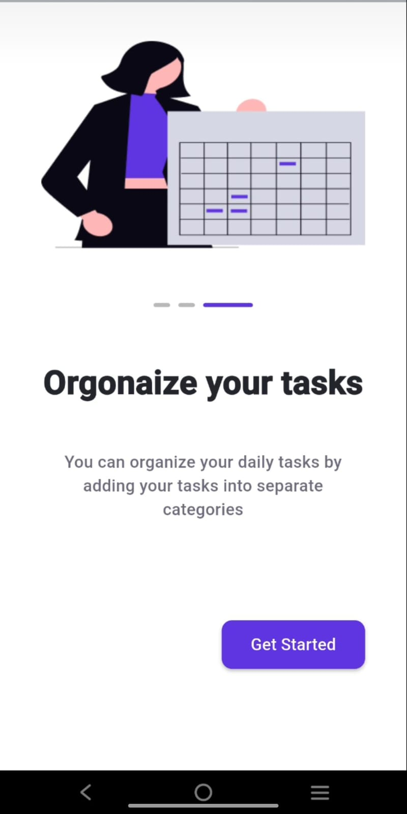
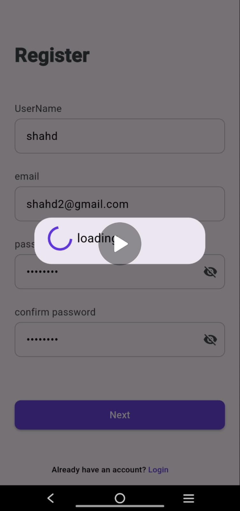
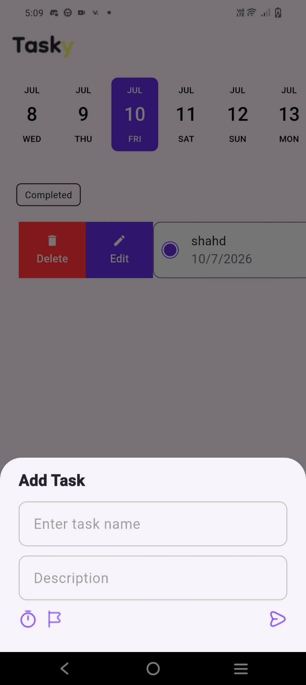
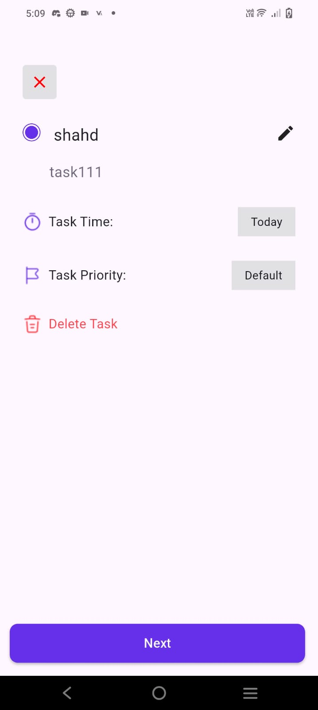
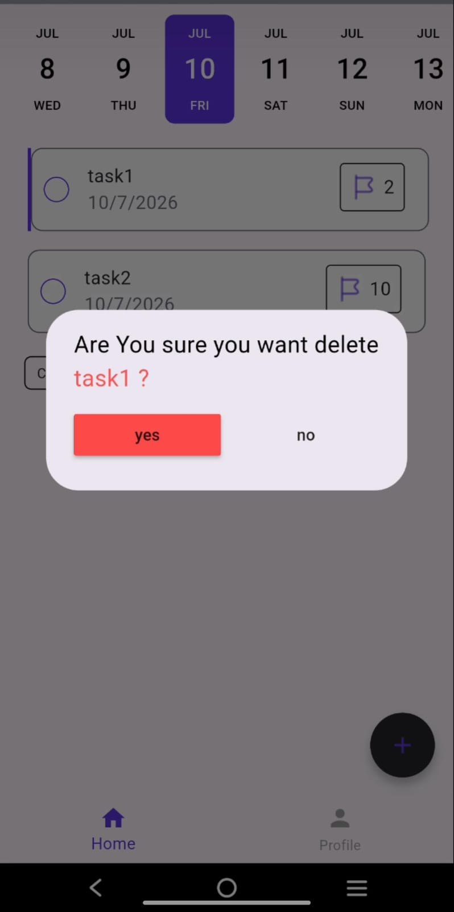
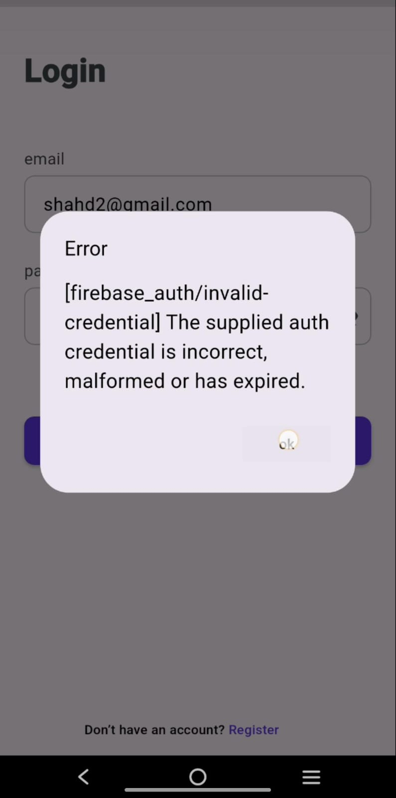

 📱 Tasky App

A modern *Task Management* application built with *Flutter & Dart* using *MVVM Architecture* and *Bloc State Management*. The app allows users to manage their daily tasks with secure Firebase authentication, real-time database synchronization, and a responsive user interface.

---

## ✨ Features

- 🔐 Secure Authentication using *Firebase Authentication*
- ☁️ Real-time task synchronization with *Cloud Firestore*
- ✅ Complete *CRUD* operations (Create, Read, Update, Delete)
- ⭐ Task Priority (High, Medium, Low)
- ✔️ Mark tasks as Completed or Pending
- 🔄 Pull-to-Refresh functionality
- 📱 Fully Responsive UI using *flutter_screenutil*
- 🚀 Onboarding Screen with *Shared Preferences*
- 👤 Profile & Edit Profile
- 🏗️ Clean *MVVM Architecture*
- 🎯 State Management using *Flutter Bloc (Cubit)*

---

## 🛠️ Tech Stack

- Flutter
- Dart
- Flutter Bloc (Cubit)
- Firebase Authentication
- Cloud Firestore
- Shared Preferences
- flutter_screenutil
- MVVM Architecture

---

## 📸 Screenshots

| Onboarding | Register| Add Task |
| :---: |:--------:|:---: |
|  |  |  |

| Edit Task |Delete Task|Error Login |
| :---: |:------------:|:-----------:|
|  |  |  | 

---

## 🚀 Getting Started

### Clone the repository

bash
git clone https://github.com/shahd-ahmed804/Task_Manger.git

### Install dependencies

bash
flutter pub get

### Run the app

bash
flutter run

---

## 👩‍💻 Author

*Shahd Ahmed*

Flutter Developer

- GitHub: https://github.com/shahd-ahmed804
- LinkedIn: https://linkedin.com/in/shahd-ahmed-613687249
